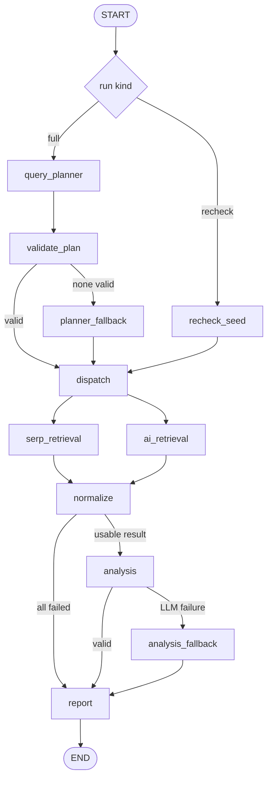

# Agentic Search Intelligence System

A production-minded implementation of the AI Agent Engineer assessment. The service registers brand profiles, plans search-intelligence retrieval, calls DataForSEO-compatible tools, normalizes evidence, analyzes visibility, and stores a structured report. It runs completely offline by default and has an explicit live mode for real credentials.

## Quick start

Requires Python 3.11 or newer.

```bash
cp .env.example .env
make setup
make test
make run
```

In a second terminal:

```bash
make demo
```

If port 8000 is occupied, run `make run PORT=8765` and then
`DEMO_BASE_URL=http://127.0.0.1:8765 make demo`.

Interactive OpenAPI documentation is available at `http://127.0.0.1:8000/docs`. The server binds only to localhost because authentication is outside the assessment scope.

## Architecture

FastAPI validates HTTP contracts and delegates run lifecycle work to a service. The service commits a `running` row before external I/O, invokes the compiled LangGraph, and persists terminal state in a short transaction. LangGraph nodes exchange typed state. Strict LangChain tool schemas validate planner calls before a provider adapter can execute them.



The explicit fan-out runs the SERP and AI channels independently. Their separate state keys meet at a LangGraph join barrier, so one expected provider failure does not discard the other channel. Retrying remains inside the provider boundary; the application graph is acyclic.

| Node | One responsibility |
|---|---|
| `query_planner` | Select typed retrieval calls |
| `validate_plan` | Reject malformed, unknown, duplicate, or excessive calls |
| `planner_fallback` | Build one safe deterministic call if every proposal is invalid |
| `serp_retrieval` | Execute only Google SERP calls |
| `ai_retrieval` | Execute only ChatGPT visibility calls |
| `normalize` | Convert raw responses to auditable evidence records |
| `analysis` | Compute visibility and synthesize grounded insights |
| `analysis_fallback` | Produce conservative analysis if synthesis fails |
| `report` | Format the terminal JSON and readable summary |
| `recheck_seed` | Seed the saved call without replanning |

## Provider and LLM modes

`DATAFORSEO_MODE=mock` uses provider-shaped local fixtures and makes no network calls. `DATAFORSEO_MODE=live` calls these fixed endpoints:

- `POST /v3/serp/google/organic/live/advanced`
- `POST /v3/ai_optimization/chat_gpt/llm_responses/live`

Live mode requires `DATAFORSEO_LOGIN` and `DATAFORSEO_PASSWORD`. It never silently replaces a failed paid call with mock data.

`LLM_MODE=mock` generates deterministic LangChain-style tool calls and deterministic synthesis. `LLM_MODE=live` binds the same two structured tools to `ChatOpenAI`, reads actual `tool_calls`, validates their names and arguments, and uses structured output for synthesis. Set `OPENAI_API_KEY` and a supported `LLM_MODEL`. The two modes are independent, so live LLM planning can be tested with mock retrieval.

The application tool schemas deliberately expose no URL, headers, credentials, or arbitrary body fields. DataForSEO endpoint selection occurs in an allowlisted adapter.

## API examples

Create a profile:

```bash
curl -s http://127.0.0.1:8000/api/v1/profiles \
  -H 'content-type: application/json' \
  -d '{
    "name":"Surfer SEO",
    "domain":"surferseo.com",
    "industry":"SEO Software",
    "description":"AI-powered SEO content optimization tool",
    "competitors":["clearscope.io","marketmuse.com","frase.io"]
  }'
```

Run the DAG (the body is optional; a profile-derived question is used when omitted):

```bash
curl -s http://127.0.0.1:8000/api/v1/profiles/PROFILE_UUID/run \
  -H 'content-type: application/json' \
  -d '{"question":"How does Surfer SEO appear for SEO software searches?","max_queries":2}'
```

Inspect results:

```bash
curl -s http://127.0.0.1:8000/api/v1/profiles/PROFILE_UUID
curl -s 'http://127.0.0.1:8000/api/v1/profiles/PROFILE_UUID/queries?min_score=0.5&status=not_visible&page=1&per_page=20'
curl -s http://127.0.0.1:8000/api/v1/profiles/PROFILE_UUID/recommendations
curl -s -X POST http://127.0.0.1:8000/api/v1/queries/QUERY_UUID/recheck
```

Run outcomes caused by upstream data availability use HTTP 200 with `status=completed|partial|failed` because the research run itself was accepted and durably recorded. Invalid input is 422, missing resources are 404, and an overlapping run for the same profile is 409.

## Visibility and scoring

Hostname matching uses parsed hostnames and an exact-or-subdomain rule. It cannot mistake `surferseo.com.evil.test` for `surferseo.com`. Organic rank is taken only from organic result fields. Brand-name mentions and target-domain citations are separate evidence.

- `visible`: the target domain occurs in adequate evidence.
- `not_visible`: adequate evidence was retrieved and the target domain did not occur.
- `unknown`: retrieval failed or the response lacked adequate evidence, such as an AI answer without citation coverage.

The required Boolean `domain_visible` is false for both `not_visible` and `unknown`; clients must use `visibility_status` to distinguish them.

The reproducible `visibility_gap_v1` score is `relevance × gap`, where the gap is 1.0 for absent, 0.5 for visible below organic position 3, and 0.2 for otherwise visible. Unknown visibility returns `score_available=false`; its serialized score of 0 is only a compatibility sentinel. For example, relevance 0.8 and an observed absence yield 0.8/high priority.

The selected retrieval endpoints do not guarantee conventional search volume or keyword difficulty. These values remain SQL `NULL`; the assessment's required integer response fields serialize them as 0 alongside `metric_availability=unavailable`. Those placeholders are excluded from scoring and prose and do not mean a measured zero.

## Failures and retries

The provider validates HTTP status, the DataForSEO outer status, task status, and result envelope. Network failures, timeouts, 429, 5xx, and a small explicit provider transient-code allowlist are retryable. Invalid arguments, authentication, ordinary 4xx, malformed envelopes, and unknown provider codes fail immediately.

There are three attempts total with exponential backoff and jitter, bounded by the run deadline. Successful sibling calls are retained after another call exhausts retries. All failed calls produce a persisted failed report rather than an uncaught provider exception. Paid live requests can be billed twice when a timeout occurs after provider acceptance; attempt and call budgets limit that risk.

To reproduce failures without keys, set one of these before starting the server:

```dotenv
MOCK_SCENARIO=transient_then_success
# or partial_failure / all_failed
```

`transient_then_success` fails the first attempt of every logical call and then succeeds. `partial_failure` exhausts the AI branch and retains SERP evidence. `all_failed` persists a failed report with no invented recommendations.

## Persistence and rechecks

SQLite stores profiles, runs, planned queries, and recommendations. Full-run reports are immutable snapshots. Query rows hold the latest checked values and `latest_check_run_uuid`. A recheck preserves its query UUID, bypasses planning, reruns retrieval through reporting, and replaces only that query's active recommendations.

Lists use the most recent terminal full run. A recheck does not change which full query set is current. A process-local per-profile lock prevents overlapping runs in the documented one-worker configuration. On startup, leftover `running` rows are marked failed/interrupted.

## Observability

Each node emits a structured JSON terminal event with its run UUID, trace ID, node name, outcome, duration, redacted input counts, output counts, and retry count. The terminal report includes coverage, API attempt counts, safe typed errors, and modes. Node events, per-node latency and success/failure rates, and per-tool logical-call/attempt/retry counts are stored with the run and emitted in the final run-summary log. Prompts, profile descriptions, credentials, authorization headers, and raw provider bodies are excluded from logs.

Example from a mock retrieval run (formatted across lines only for readability):

```json
{
  "event": "node_finished",
  "run_uuid": "737e33e5-77b1-428e-931f-51156eafdc44",
  "trace_id": "83a34b32-0964-4ebc-ac73-dbce3865c794",
  "node": "serp_retrieval",
  "status": "success",
  "duration_ms": 0.255,
  "input_summary": {
    "tool_name": "search_google_serp",
    "calls": 1
  },
  "output_summary": {
    "calls": 1,
    "failures": 0,
    "api_attempts": 1
  },
  "retry_count": 0
}
```

A persisted run metric summary uses this shape:

```json
{
  "per_node": {
    "serp_retrieval": {
      "executions": 1,
      "successes": 1,
      "failures": 0,
      "avg_duration_ms": 0.255,
      "success_rate": 1.0,
      "failure_rate": 0.0,
      "retry_count": 0
    }
  },
  "api_calls": {
    "search_google_serp": {
      "logical_calls": 1,
      "attempts": 1,
      "retries": 0,
      "successes": 1,
      "failures": 0
    }
  }
}
```

Production extensions would add OpenTelemetry or LangSmith spans with strict redaction, Prometheus-compatible metrics, dashboards and alerts, durable distributed job ownership, a task queue, request tracing middleware, and storage retention controls. External tracing remains opt-in because profile and evidence content may be confidential.

## Verification

The default suite requires no keys or network:

```bash
make lint
make typecheck
make test
```

Tests cover the real compiled graph and all required endpoints: happy path, transient recovery, partial fallback, all-failed persistence, invalid tool arguments, filters, HTTP validation, rechecks, redacted node observability, retry metrics, most-recent-run statistics, and a one-time fan-in/report assertion. Live smoke testing is deliberately excluded from default tests to prevent API spend.

`requirements.lock` records the exact environment used for verification; `make setup` installs it before the editable package.

## Known limitations

- AI and SERP results are point-in-time samples and cannot represent every user, geography, model, or future response.
- Live DataForSEO response variations beyond the documented item shapes may require additional normalizer mappings.
- The baseline uses schema bootstrapping rather than Alembic migrations.
- SQLite and process-local locks assume one application worker.
- No authentication, background queue, circuit breaker, UI, or search-volume enrichment is included.
- Token usage remains unavailable in deterministic mock mode; no total is fabricated.
- Live DataForSEO and live OpenAI modes require the evaluator's credentials and should be smoke-tested explicitly before claiming provider success.
